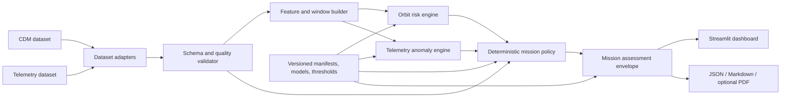
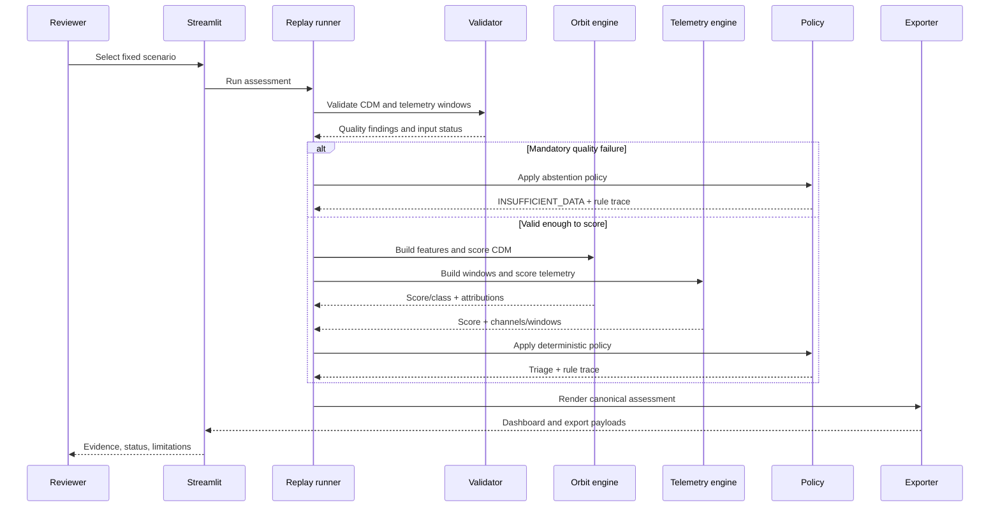

# Architecture — VymoaGaurd PHM

## 1. Architectural intent

The architecture is a local, modular pipeline. It emphasizes evidence traceability, deterministic policy, and replayability over distributed infrastructure or model novelty.

## 2. Context diagram



## 3. Logical components

### A. Dataset adapters

Inputs are selected from the source brief’s candidate datasets: ESA Collision Avoidance Challenge for CDM risk and either ESA OPSSAT-AD or NASA SMAP/MSL for telemetry. Adapters produce a common internal shape and a manifest; they do not silently download or mutate data.

### B. Validator

The validator is a hard gate. It checks schema, missingness, timestamps, duplicates, freshness, unsupported values, contradictions, and split overlap. It emits structured findings that are visible in the report.

### C. Feature and window builder

This component builds CDM event features and telemetry windows. It owns fit-on-train-only preprocessing, feature schema, imputation, scaling, and feature provenance. Future information must never cross a temporal boundary into training.

### D. Orbit risk engine

Primary capability. It begins with calibrated logistic regression or a transparent tree baseline. The selected model is the simplest model that passes the frozen acceptance matrix. Its explanations are feature attributions.

### E. Telemetry anomaly engine

Secondary capability. It uses robust rolling statistics and Isolation Forest over a bounded channel subset. It returns an anomaly score, channel/window evidence, and evaluation reference. It is not a failure-probability engine.

### F. Mission decision policy

The policy combines evidence through explicit rules. It can make a compound state `RED` when both evidence streams are high, but this is a deterministic triage classification, not a calibrated joint risk probability. It returns a rule trace and can abstain.

### G. Assessment and report envelope

`MissionAssessment` is the canonical output. It contains run identity, inputs, quality findings, model outputs, attributions, decision, versions, timestamps, and limitations. All views derive from it.

### H. Presentation layer

Streamlit provides the four screens in the source brief. It should remain a thin view layer over the domain pipeline. Reports provide the same information for review and sharing.

## 4. Data flow sequence



## 5. Deployment shape

The MVP runs locally:

```text
Local machine
├── Python domain package
├── Streamlit process
├── Parquet/SQLite data store
├── versioned model artifacts
├── policy/config manifests
└── report/export directory
```

No cloud service, message broker, remote inference endpoint, or multi-user identity layer is required for the MVP. Such additions would require a new threat model and reliability review.

## 6. Architectural invariants

1. The UI cannot own safety or scoring logic.
2. Every assessment is reproducible from a manifest and version set.
3. Model outputs and anomaly scores retain their original semantics.
4. Rule-based cross-domain combination is not presented as a probability.
5. Bad inputs produce visible warnings or abstention, never silent defaults.
6. Optional models can be removed without breaking the validated baseline.

## 7. Key risks and mitigations

| Risk | Mitigation |
|---|---|
| Invalid target labels | Week 1 label audit; downgrade claim to ranking/triage if needed. |
| Temporal leakage | Chronological/group split tests and fit-on-train-only transforms. |
| Misleading explanations | Label SHAP as attribution; retain feature values and test stability. |
| Anomaly score overinterpretation | Use explicit score terminology and injected-fault evaluation. |
| Scope creep | Hard fallback: primary orbit baseline + telemetry secondary + policy + replay. |
| UI hides uncertainty | Make data quality, abstention, confidence/calibration, and limitations first-class panels. |
